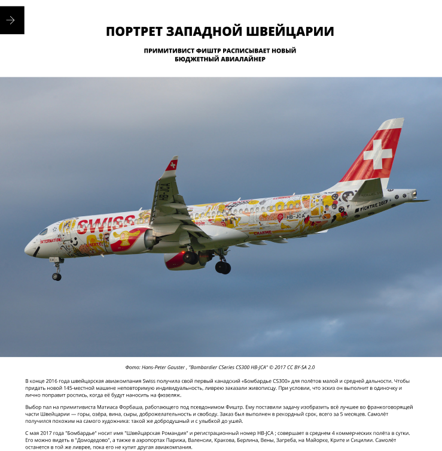
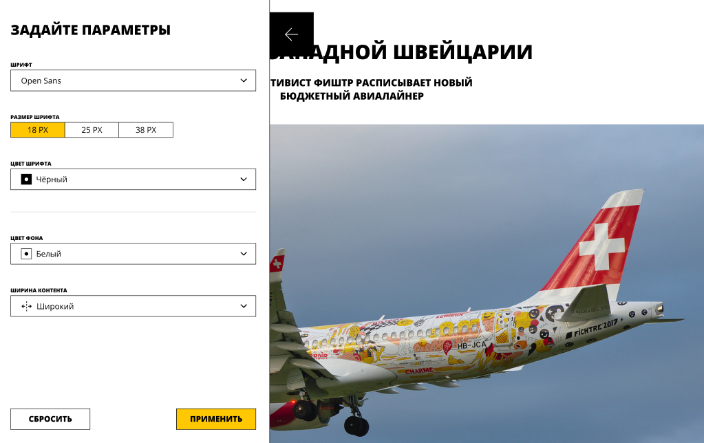
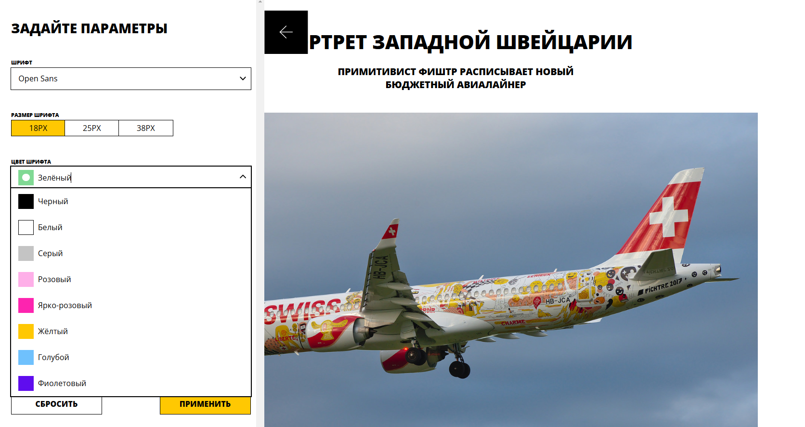

## Кастомизация страницы блога через открывающуюся панель.

### Проектные задачи:

- Собрать форму редактирования свойств.
- Настроить всю необходимую функциональность.
- Обеспечить передачу данных между формой и страницей блога.

### Функционал:

#### Страница блога

- Настройки устанавливаются через CSS-переменные.

#### Сайдбар

- При нажатии на «стрелку» открывается сайдбар с настройками, при повторном нажатии или клике вне сайдбар закрывается.

#### Настройки

- При изменении настроек в сайдбаре они не применяются сразу.
- При нажатии «сбросить» настройки в форме сбрасываются на те, что были при открытии страницы и применяются к статье.

#### Результат

- После нажатия на «применить» стили применяются к статье.

### _Stack: SCSS, Storybook, TS, React_
